<div align="center">

<a href="https://github.com/bren-wp/Keyra"></a>

# Keyra

### Your digital life. One beautifully protected vault.

**A refined, privacy-first password manager for Android and iOS.**

Secure passwords, private notes, cards, identities, Wi-Fi credentials and authenticator codes — without registration, ads or a Keyra cloud account.

[](https://github.com/bren-wp/Keyra/releases/latest)
[](https://github.com/bren-wp/Keyra/actions/workflows/android.yml)
[](https://github.com/bren-wp/Keyra/actions/workflows/ios.yml)

[Explore](#explore-keyra) · [Privacy](#built-around-privacy) · [Download](#download--installation) · [Build](#build-from-source) · [Security](#security--responsible-disclosure)

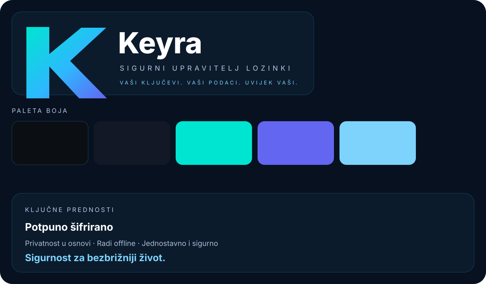

</div>

---

## Beautifully simple. Thoughtfully secure.

Your important information deserves more than an endless list of passwords. Keyra gives it a considered home: an elegant dark interface, clear navigation, useful security insights and familiar actions that feel effortless.

<table>
<tr>
<td width="33%" align="center"><strong>🔒 Privacy by design</strong><br><sub>No account, advertising SDK, analytics or Keyra-operated sync service.</sub></td>
<td width="33%" align="center"><strong>✨ Crafted for clarity</strong><br><sub>Thoughtful typography, useful collections and a distraction-free experience.</sub></td>
<td width="33%" align="center"><strong>📱 Two platforms, one experience</strong><br><sub>Android and iOS, with portable encrypted backups.</sub></td>
</tr>
</table>

## Explore Keyra

<div align="center">
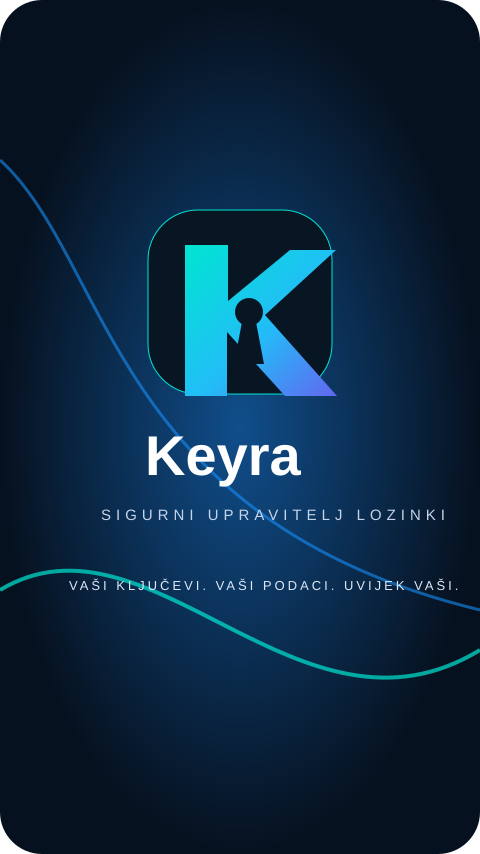
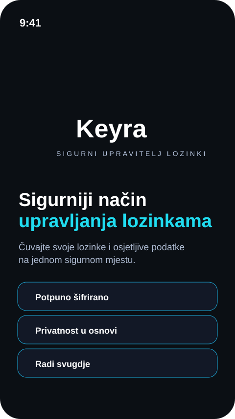
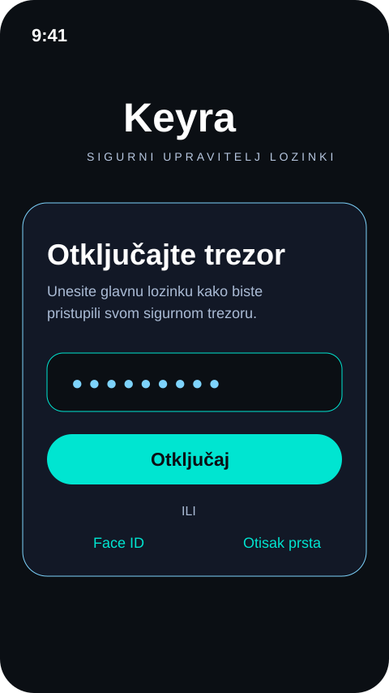
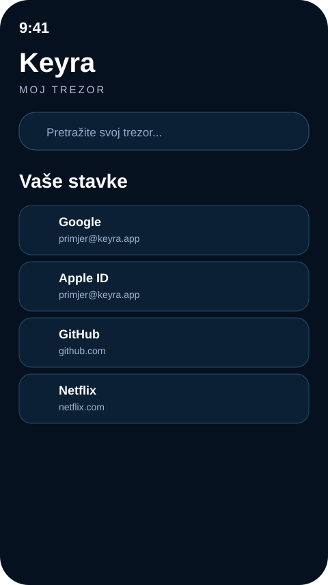

<sub>Existing Keyra UI illustrations; appearance may differ on individual screens and devices.</sub>
</div>

### Your vault, your way

| Organize everything | Take control of security |
| --- | --- |
| **Passwords & logins** — store the credentials that matter | **Password generator** — adjust length and character groups |
| **Private notes** — protect information beyond logins | **Security Center** — weak/reused password and invalid TOTP alerts |
| **Payment cards** — card details and expiry warnings | **TOTP codes** — offline, RFC 6238-compatible authenticator |
| **Identities & Wi-Fi** — fields built for each type | **Biometric access** — supported device authentication |
| **Favorites & collections** — find what you need quickly | **Automatic lock** — protect the vault when you leave |
| **Encrypted backups** — deliberately export and restore | **Recovery Key** — the existing KEYRAREC1 recovery process |

<div align="center">
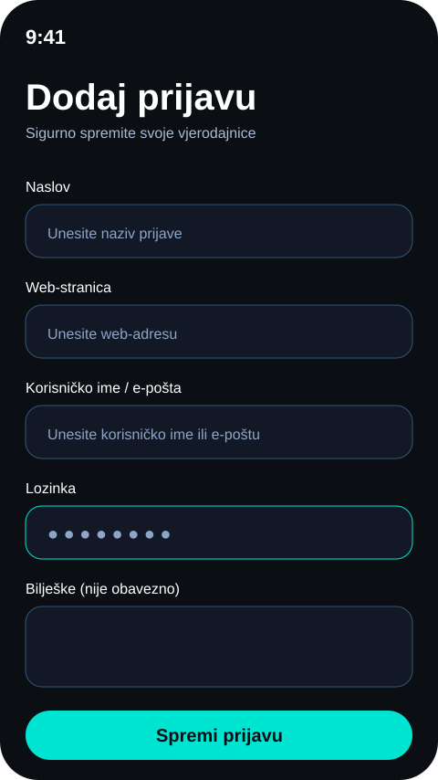
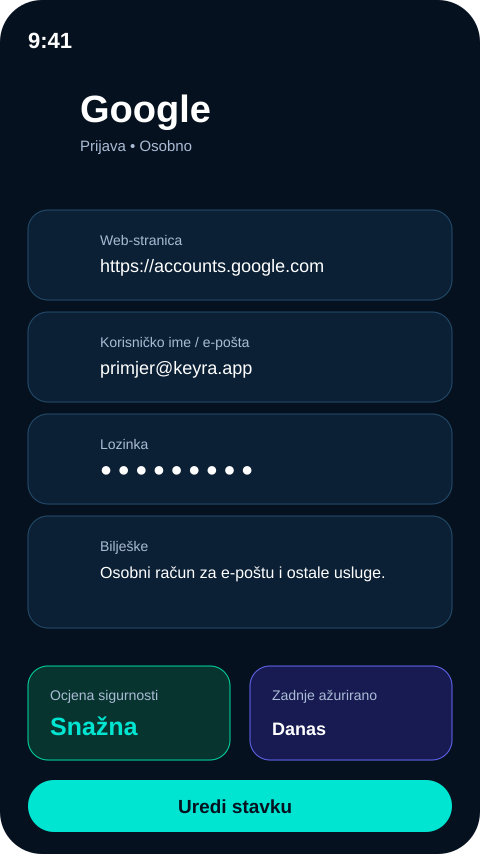
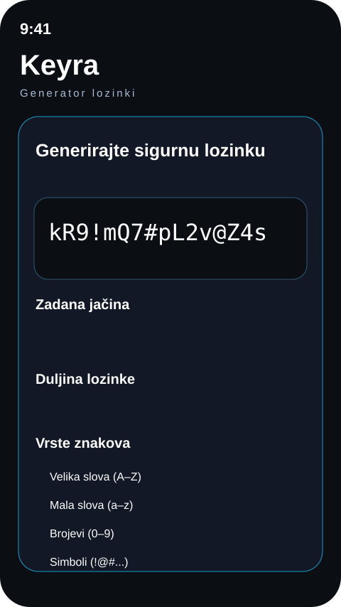
</div>

### The little things matter

Useful search, dedicated item editors, hidden sensitive values, understandable error messages, and clipboard content that expires. Every new vault starts empty: no invented accounts or example passwords.

<div align="center">
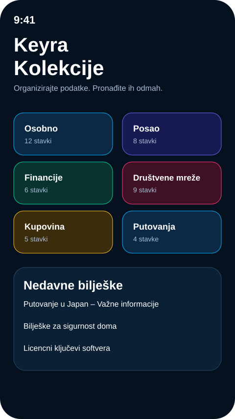
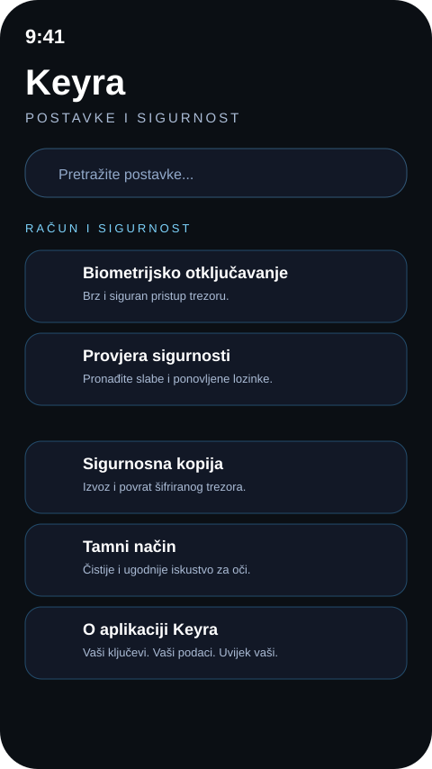
</div>

## Built around privacy

Keyra's core vault operates without a user account or a Keyra-operated backend. On Android the app does not request Internet permission; the code contains no analytics or remote-sync SDK. Files are exported only when you choose the destination.

| Protection | Current implementation |
| --- | --- |
| Encrypted vault | AES-256-GCM |
| Master-password verifier | PBKDF2-HMAC-SHA-256, 600,000 iterations for current records |
| Protected device key | Android Keystore / Apple Keychain |
| Access control | Supported biometric or device authentication |
| Sensitive UI | Android screenshot restrictions / iOS privacy shield where supported |
| Clipboard | Copied secrets remain briefly available for external pasting. Android uses a short-lived, keyed ownership tag (not a second plaintext copy) and attempts cleanup after ~30 seconds. iOS uses a 30-second pasteboard expiration. Successful full-vault erasure also clears Keyra-owned pasteboard content where the OS allows it; neither platform promises guaranteed clipboard removal. |
| Portable backup | Encrypted KEYRA2; legacy KEYRA1 compatible |
| Recovery | KEYRAREC1, separate from the actual vault backup |

**Privacy is a design principle, not an absolute guarantee.** A compromised device, another app's clipboard access, weak master passwords, or an unprotected exported backup can still expose information. See [SECURITY.md](SECURITY.md) and [PRIVACY.md](PRIVACY.md).

### Your backup. Your choice.

Export an encrypted `.keyra` document, then save it through your preferred system file provider, including compatible private cloud apps. This is **manual document export/import**, not automatic background cloud sync. Your Recovery Key is not a backup of your vault contents; the two files may both be needed for recovery.

[Recovery guide](docs/RECOVERY_KEY.md) · [Private document backup](docs/PRIVACY_CLOUD_BACKUP.md)

## Download & installation

### [⬇ Get Keyra from GitHub Releases](https://github.com/bren-wp/Keyra/releases/latest)

The release workflow publishes these file types:

| Release file | Purpose |
| --- | --- |
| `Keyra-*-Android-debug.apk` | Debug-signed Android build for testing |
| `Keyra-*-Android-unsigned.apk` | Unsigned APK, **requires signing** |
| `Keyra-*-Android.aab` | App Bundle, **not automatically production-signed** |
| `Keyra-*-iOS-Simulator.zip` | Build for iOS simulator QA |
| `Keyra-*-iOS-unsigned.ipa` | Unsigned IPA, **not ready for normal iOS installation or App Store** |
| `SHA256SUMS-Android.txt`, `SHA256SUMS-iOS.txt` | File integrity checksums |

**Android:** verify the release checksums, then install the debug APK on a compatible testing device. The debug APK is not intended as a store-ready production package.

**iOS:** use the Xcode simulator build or create a correctly provisioned and signed device build. An unsigned IPA cannot be installed as a normal App Store app. This README does not claim that Keyra is published in the app stores.

## Build from source

### Android

Use Java 17, Gradle 8.13 and the required Android SDK, matching the CI toolchain.

```bash
git clone https://github.com/bren-wp/Keyra.git
cd Keyra
gradle -p android :app:lintDebug :app:testDebugUnitTest :app:assembleDebug
```

### iOS

Use macOS, Xcode and the appropriate iOS SDK. The current CI requirement is documented in [.github/workflows/ios.yml](.github/workflows/ios.yml).

```bash
git clone https://github.com/bren-wp/Keyra.git
cd Keyra
xcodebuild -project ios/Keyra.xcodeproj -scheme Keyra \
  -sdk iphonesimulator -configuration Debug \
  CODE_SIGNING_ALLOWED=NO build
```

### Quality standards

Android CI checks lint, unit tests, builds and privacy restrictions. iOS CI runs builds, static analysis, privacy checks and a simulator launch smoke test. Release validation runs separately from the merged `main` commit.

**Passing automated checks does not prove every screen or keyboard interaction works on physical devices.** Known gaps stay visible in [GitHub Issues](https://github.com/bren-wp/Keyra/issues) and the [release QA checklist](docs/STORE_RELEASE_CHECKLIST.md).

## Security & responsible disclosure

For security problems, follow [SECURITY.md](SECURITY.md). Never post actual passwords, recovery keys, TOTP secrets, vault exports or unredacted crash logs in public GitHub issues.

[Security](SECURITY.md) · [Privacy](PRIVACY.md) · [Android data safety](docs/PLAY_DATA_SAFETY.md) · [iOS privacy](docs/APP_STORE_PRIVACY.md) · [Open issues](https://github.com/bren-wp/Keyra/issues)

---

<div align="center">
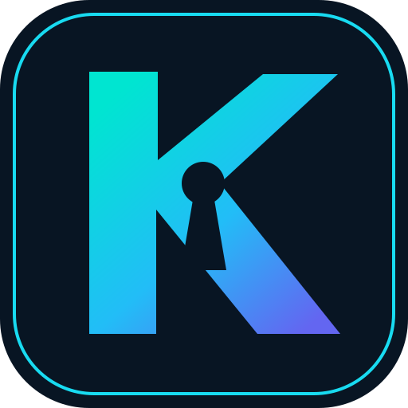

### Keyra

**Everything important. Beautifully protected.**

<sub>Made for privacy-conscious people on Android and iOS.</sub>
</div>
